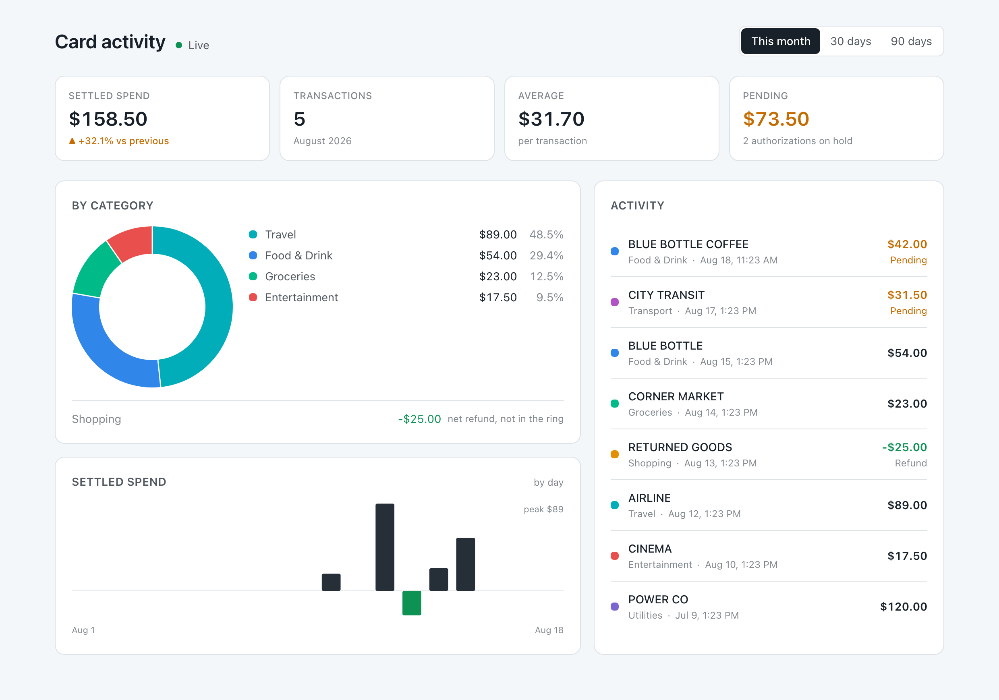

# Card activity

A cardholder dashboard for a Stripe Issuing card programme. A swipe appears in the feed
about a second after it happens, and the spend metrics move with it.

The dashboard is the easy half. The interesting half is underneath it: Stripe delivers
webhooks at least once, in no guaranteed order, and will redeliver an event that was
already handled. The write path is built so none of that shows. An event can arrive twice,
or late, or a capture can land before the authorization it settles, and the feed still
shows exactly one row for one purchase with the right number beside it.



The architecture, the assumptions it rests on, and the reasoning behind each decision are
in [DESIGN.md](./DESIGN.md).

## Run it

Needs Docker and Node 20.19+, 22.12+ or 24+. No Stripe account is needed for this part.

```bash
cp .env.example .env      # the placeholder Stripe values are enough to boot
npm install
npm run db:up             # Postgres 16, host port 5433
npm run db:migrate
npm run db:seed           # the one cardholder this deployment serves
npm run db:demo           # sample activity, so the dashboard has something to show
npm run dev               # api on :3000, web on :5173
```

Open <http://localhost:5173>.

`npm run db:demo` is safe to re-run. It loads two pending authorizations, four spend
categories, a refund large enough to turn its category net negative, and one transaction
old enough to sit outside "This month" but inside "90 days". Between them that covers
every state the dashboard draws. Clear it whenever you like:

```bash
docker compose exec -T postgres psql -U karat -d karat_card_activity \
  -c "DELETE FROM cards WHERE stripe_id = 'ic_demo'"
```

## Watch it update live

This part needs a Stripe sandbox with Issuing enabled and the
[Stripe CLI](https://docs.stripe.com/stripe-cli). Put your real secret key in `.env`
first, then create a cardholder and a card to spend on:

```bash
stripe post /v1/issuing/cardholders -d type=individual -d name="Ada Lovelace" \
  -d email=ada@example.com -d "billing[address][line1]=510 Townsend St" \
  -d "billing[address][city]=San Francisco" -d "billing[address][state]=CA" \
  -d "billing[address][postal_code]=94103" -d "billing[address][country]=US"

# put the returned ich_… in CARDHOLDER_STRIPE_ID, then:
npm run db:seed

stripe post /v1/issuing/cards -d cardholder=ich_… -d currency=usd \
  -d type=virtual -d status=active
```

Point Stripe at the webhook endpoint. The secret it prints goes in
`STRIPE_WEBHOOK_SECRET`, and the API needs a restart to pick it up:

```bash
stripe listen --forward-to localhost:3000/api/v1/webhooks/stripe
```

There is no card row to create locally. An authorization arrives with its card expanded,
so ingestion stores the card and the cardholder from the event itself.

With the dashboard open, spend on the card from another shell:

```bash
stripe post /v1/test_helpers/issuing/authorizations \
  -d card=ic_… -d amount=4200 -d "merchant_data[name]=BLUE BOTTLE COFFEE" \
  -d "merchant_data[category]=eating_places_restaurants"
#   a Pending row appears at the top within about a second, without a reload,
#   and the pending tile goes up. Settled spend does not move: nothing has been charged.

stripe post /v1/test_helpers/issuing/authorizations/iauth_…/capture
#   the same row turns settled, and the metrics and the breakdown move.
#   Still ONE row.
```

That last assertion, **still one row**, is the whole design in one observation. Stripe has
two objects for one purchase, an authorization and the transaction that settles it, and
they can arrive in either order. Getting one row out of that, every time, is what the
write path is for.

## What to read first

The code that carries a claim, grouped by the claim it carries.

**Writes survive redelivery and reordering**

- [`webhooks/stripe-event.repository.ts`](apps/api/src/webhooks/stripe-event.repository.ts)
  stores each event once, keyed by Stripe's event id. It inserts and skips conflicts
  rather than reading then writing, so two concurrent deliveries of one event cannot both
  decide they are first.
- [`ingestion/activity.repository.ts`](apps/api/src/ingestion/activity.repository.ts) is
  the heart of it. A conditional upsert, in a single statement, turns a replayed or
  out-of-order delivery into a no-op instead of a regression:

  ```sql
  ON CONFLICT (stripe_id) DO UPDATE SET …
  WHERE authorizations.last_event_at <= EXCLUDED.last_event_at
  ```

- [`ingestion/transaction.normalizer.ts`](apps/api/src/ingestion/transaction.normalizer.ts)
  derives a refund's sign from its type rather than trusting the sign Stripe sent, so an
  unexpected value cannot flip spend into income.

**One row per purchase**

- [`activity/unsettled-authorization.ts`](apps/api/src/activity/unsettled-authorization.ts)
  is the single predicate deciding when an authorization still counts as activity. The
  feed and the pending metric share it, so the two can never disagree about what pending
  means.
- [`activity/activity-feed.repository.ts`](apps/api/src/activity/activity-feed.repository.ts)
  merges both tables in one statement and pages by row comparison, which is the same shape
  as the index it reads, so paging is a range scan rather than scan-and-discard.

**Money is never a float**

- [`common/money.ts`](apps/api/src/common/money.ts) takes an integer count of minor units
  and returns a display string. Amounts are stored, summed and compared as integers
  throughout; the only division happens on the way to `Intl`, where the result is
  immediately rounded to the currency's own decimal places.

**Freshness**

- [`activity/activity-event-bus.ts`](apps/api/src/activity/activity-event-bus.ts) and
  [`activity/activity-stream.controller.ts`](apps/api/src/activity/activity-stream.controller.ts)
  push a nudge, not data. Nothing is buffered, because a client that missed one becomes
  current by refetching.
- [`web/src/hooks/use-activity-stream.ts`](apps/web/src/hooks/use-activity-stream.ts) is
  the other end: it turns that nudge into a cache invalidation, which is why the page
  polls nothing and ignores window focus.

**Seams, for the constraints that will not last**

- [`processor/card-processor.ts`](apps/api/src/processor/card-processor.ts) is a port.
  Consumers inject a token, never the Stripe class, so a fake can be bound in its place.
- [`cardholder/current-cardholder.service.ts`](apps/api/src/cardholder/current-cardholder.service.ts)
  is where "no login, one cardholder from config" lives, and nowhere else. Real
  authentication replaces this service instead of every query.

**Aggregates**

- [`insights/spend-period.ts`](apps/api/src/insights/spend-period.ts) resolves each period
  and the comparable window before it. Month to date is measured against the same stretch
  of the previous month rather than the whole of it, clamped so a long month compared
  against a short one cannot reach into the current period.
- [`insights/insights.repository.ts`](apps/api/src/insights/insights.repository.ts) fills
  empty trend buckets with zero, so a quiet week is drawn as an empty one instead of a
  narrower one.

## The API contract

The DTOs are the contract. They are zod schemas, `@nestjs/swagger` turns them into an
OpenAPI document, and the API's build writes it to
[`apps/api/openapi.json`](apps/api/openapi.json). Orval generates the web app's types and
TanStack Query hooks from that file, so nothing is typed twice and a change to a DTO shows
up as a compile error in the browser code.

The generated client is not committed, since it is derivative and every `dev`, `build` and
`typecheck` regenerates it. The spec is committed, because a diff on it is the clearest
signal that the client contract moved.

With the API running, the spec is also served at
<http://localhost:3000/api/v1/docs-json>, and Swagger UI at
<http://localhost:3000/api/v1/docs>.

## Commands

| Command                     | What it does                                      |
| --------------------------- | ------------------------------------------------- |
| `npm run dev`               | API and web together, both watching               |
| `npm run build`             | Builds both, and re-emits `openapi.json`          |
| `npm run typecheck`         | Type-checks both workspaces                       |
| `npm run format:check`      | Prettier, repo wide                               |
| `npm run db:up` / `db:down` | Starts or stops Postgres                          |
| `npm run db:reset`          | Drops the volume, so migrate and seed again after |
| `npm run db:migrate`        | Applies migrations                                |
| `npm run db:seed`           | Creates the configured cardholder                 |
| `npm run db:demo`           | Loads sample activity                             |
| `npm run db:studio`         | Prisma Studio, to browse the tables               |
